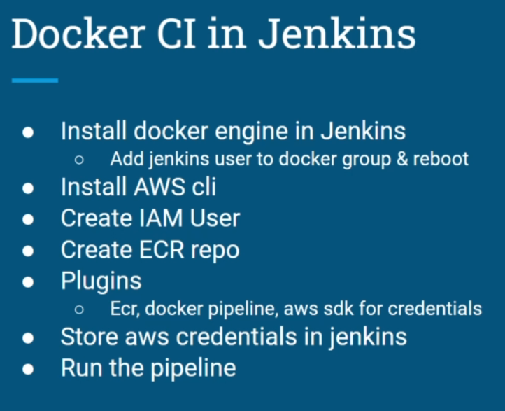

# pipeline

1- IAM User with ECR permission [Permissions: AmazonEC2ContainerRegistryFullAccess,         AmazonECS_FullAccess]
2- Store AWS credentials in jenkins
3- Create ECR repo on AWS
4- Plugins: docker pipeline, ecr, aws sdk-all, cloudbees docker build & publish

```
    environment{
        registryCredentials = 'ecr:region:CredentialID'
        appRegistry = "ImageURL i.e. registryURL/registryName"
        vprofileRegistry = "RegistryURL
    }

    ```
        environment{
            registryCredentials= 'ecr:us-east-1:IAM_User'
            appRegistry= "account.dkr.ecr.us-east-1.amazonaws.com/vprofileapp"
            vprofileRegistry= "https://account.dkr.ecr.us-east-1.amazonaws.com"
        }
    
    ```

    stage('Build App Image') {
       steps {
       
         script {
                dockerImage = docker.build( appRegistry + ":$BUILD_NUMBER", "./Docker-files/app/multistage/")
             }

     }
    
    }

    stage('Upload App Image') {
          steps{
            script {
              docker.withRegistry( vprofileRegistry, registryCredential ) {
                dockerImage.push("$BUILD_NUMBER")
                dockerImage.push('latest')
              }
            }
          }
     }

```




